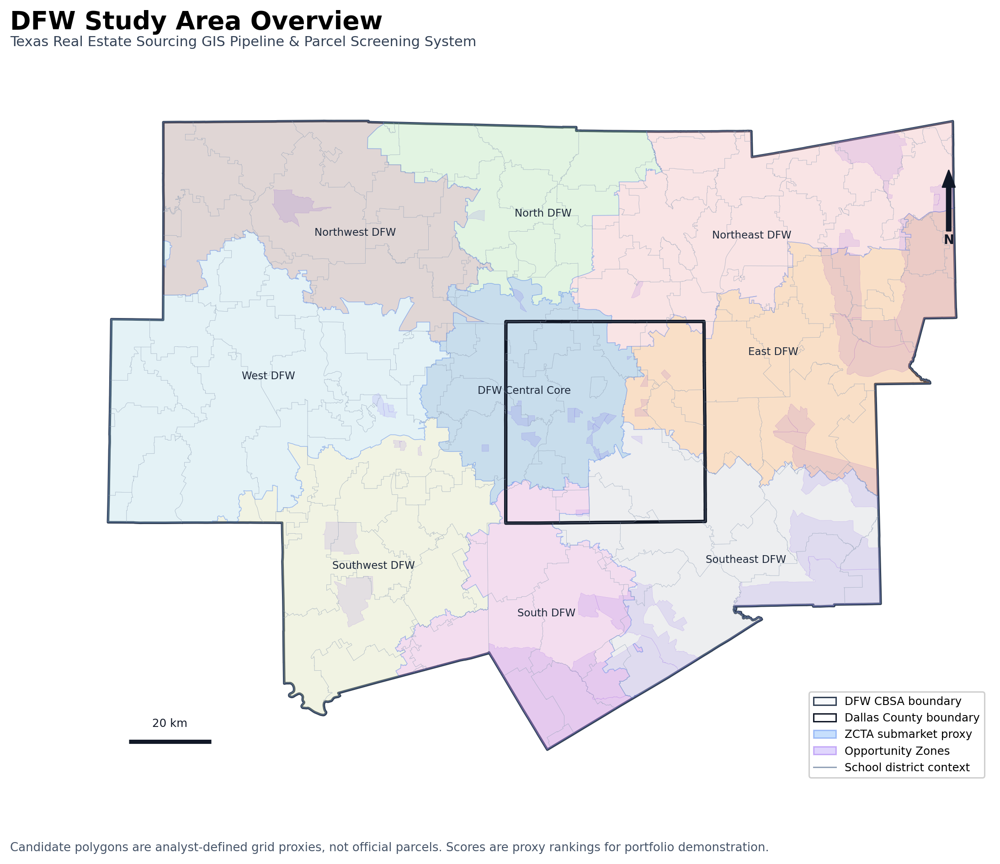
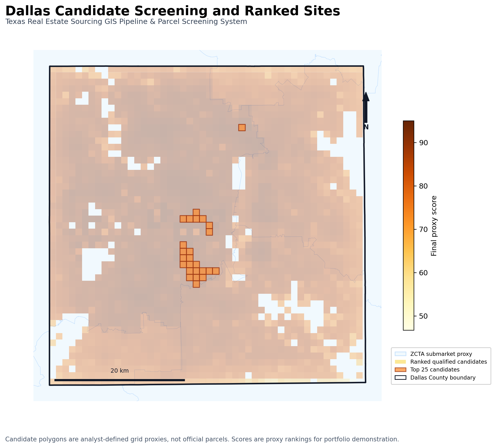
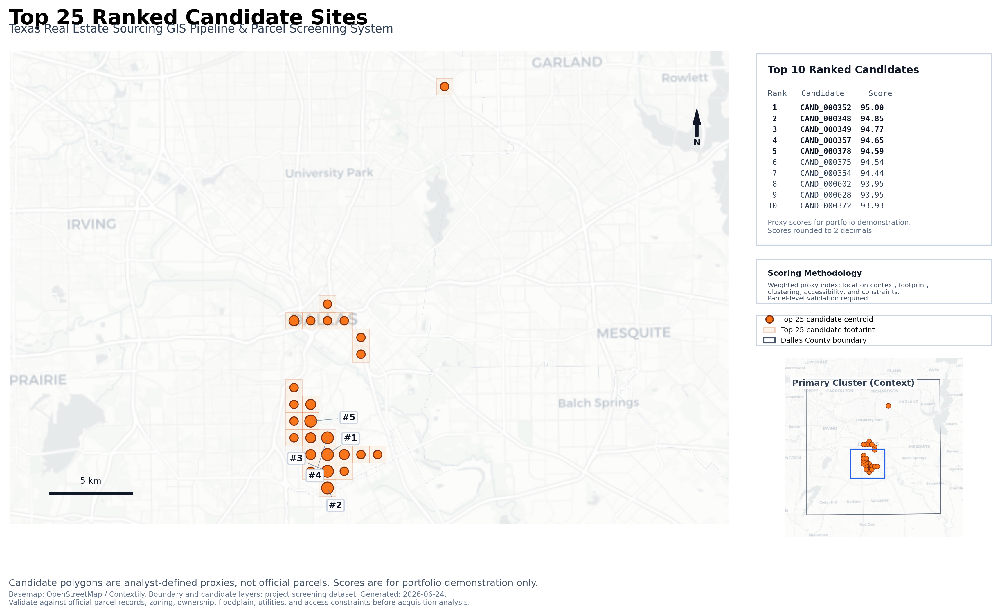

# Texas Real Estate Sourcing GIS Pipeline & Parcel Screening System

## Summary

A portfolio-grade Python/QGIS GIS pipeline for real estate sourcing in the Dallas-Fort Worth market, with a Dallas County candidate-screening demonstration. The project turns public GIS layers into validated boundaries, analyst-defined submarkets, candidate-site proxy polygons, ranked sourcing outputs, platform-ready GeoJSON files, static map exports, and an interactive Folium web map.

## Preview Maps

### DFW Study Area Overview


### Dallas Candidate Screening and Ranked Sites


### Top 25 Ranked Candidate Sites


## Problem Statement

Real estate sourcing teams need repeatable geospatial workflows that can move from raw public GIS data to defensible screening layers, explainable candidate ranking, and polished deliverables. This project asks:

Where in the DFW / Dallas County market are promising candidate areas after applying transparent geography, context, screening, and proxy scoring logic?

## What The Pipeline Does

The pipeline:

1. Downloads and stages Census TIGER/Line 2025 boundaries.
2. Builds DFW and Dallas County study area layers.
3. Creates analyst-defined ZCTA-based submarket proxy polygons.
4. Validates and catalogs project GIS layers.
5. Adds Opportunity Zone and school district context layers.
6. Creates analyst-defined candidate-site grid proxy polygons.
7. Applies transparent screening rules, including waterbody exclusion QA, and disqualification audit logic.
8. Scores and ranks qualified proxy candidates with the v2 professional proxy screening model.
9. Exports platform-ready GeoJSON and GeoPackage packages.
10. Builds an interactive web map and static PNG/PDF portfolio maps.

## Key Outputs

- Platform-ready GeoJSON package
- GeoPackage exports for desktop GIS review
- Candidate screening audit trail
- Weighted candidate ranking
- Top 25 candidate sites layer
- Interactive Folium web map
- Static PNG/PDF portfolio maps
- Documentation and methodology files

Generated data and full map outputs are intentionally ignored by git. Selected portfolio preview maps are tracked under `docs/assets/`.

## Tools Used

- Python
- GeoPandas
- Pandas
- Shapely
- PyProj
- Pyogrio / Fiona-compatible vector IO
- Folium / Leaflet
- Matplotlib
- QGIS-ready GeoPackage outputs

## Project Structure

```text
data/raw/                 Local raw source files, ignored by git
data/processed/           Intermediate generated files, ignored by git
data/final/geojson/       Final GeoJSON outputs, ignored by git
data/final/csv/           Final CSV outputs, ignored by git
data/final/gpkg/          Final GeoPackage outputs, ignored by git
docs/                     Methodology, sources, dictionary, case study
outputs/maps/             Static PNG/PDF map exports, ignored by git
outputs/tables/           Export summary tables, ignored by git
outputs/webmap/           Interactive HTML map, ignored by git
qgis/                     QGIS handoff notes
scripts/                  Reproducible pipeline scripts
```

## Run Locally

Create an environment and install dependencies:

```bash
git clone https://github.com/hberksafak/texas-real-estate-gis-pipeline.git
cd texas-real-estate-gis-pipeline
python3 -m pip install -r requirements.txt
```

For exact current release outputs, stage the documented public context source
files in `data/raw/hud_opportunity_zones/` and
`data/raw/texas_school_districts/` as described in
[Download plan](docs/download_plan.md). Census TIGER/Line inputs are downloaded
or reused automatically by the pipeline. Raw source files are intentionally not
committed to git.

Run the source preflight, then the full pipeline:

```bash
python3 scripts/check_required_sources.py
python3 scripts/run_full_pipeline.py
```

The source preflight checks for the manually staged HUD Opportunity Zone and
Texas school district context files required for exact release reproduction. The
runner executes the milestone scripts in dependency order, stops on the first
failure, writes a Top 25 rank/export consistency audit, runs repository QA, and
prints candidate counts plus output folder locations.

Expected local outputs are documented in [Expected outputs](docs/expected_outputs.md).

## Analytical QA

The frozen v2 model, candidate counts, waterbody and edge-fragment checks,
reproducibility evidence, and limitations are summarized in
[Analytical QA summary](docs/analytical_qa_summary.md).

## Milestone Summary

- Milestone 1: project skeleton
- Milestone 2: source documentation and download plan
- Milestone 3: Census DFW / Dallas study area setup
- Milestone 4: ZCTA-based submarket proxy builder
- Milestone 5: reusable GIS cleaning and validation factory
- Milestone 6/6B: platform-ready real estate layer catalog with context layers
- Milestone 7: candidate-site screening foundation and audit trail
- Milestone 8: weighted candidate scoring and ranking
- Milestone 9: platform-ready GeoJSON export package
- Milestone 10: interactive Folium web map
- Milestone 11: static portfolio map exports
- Milestone 12: portfolio case study and repository QA

## Documentation

- [Data sources](docs/data_sources.md)
- [Download plan](docs/download_plan.md)
- [Expected outputs](docs/expected_outputs.md)
- [Analytical QA summary](docs/analytical_qa_summary.md)
- [Methodology](docs/methodology.md)
- [Data dictionary](docs/data_dictionary.md)
- [Portfolio case study](docs/portfolio_case_study.md)

## Portfolio Deliverables

- `data/final/geojson/platform_export/`
- `data/final/gpkg/export_ready_layers.gpkg`
- `data/final/gpkg/ranked_candidate_sites.gpkg`
- `data/final/csv/disqualification_audit.csv`
- `data/final/csv/ranked_site_candidates.csv`
- `outputs/webmap/texas_real_estate_sourcing_webmap.html`
- `outputs/maps/png/`
- `outputs/maps/pdf/`

## Current Status

Release-grade reproducibility runner added. Frozen v2 scoring model complete, rank/export consistency QA is generated by the full pipeline runner, and repository QA verifies the expected release outputs.

## Limitations

No official parcel ownership or legal parcel boundary data is used yet. Candidate polygons are analyst-defined grid proxies, not official parcels. Scores are transparent proxy rankings for portfolio demonstration, not legal development feasibility, valuation, underwriting, engineering, floodplain, utility, access, or zoning determinations.

The current scoring model is `v2_professional_proxy_screening_limited`. Road accessibility, FEMA flood, and NCTCOG land-use suitability are not implemented because those source layers are not staged locally.

School district context is neutral context only. Opportunity Zones are policy/incentive context only. This project does not use demographic targeting language or protected-class logic.
